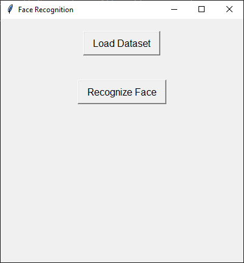
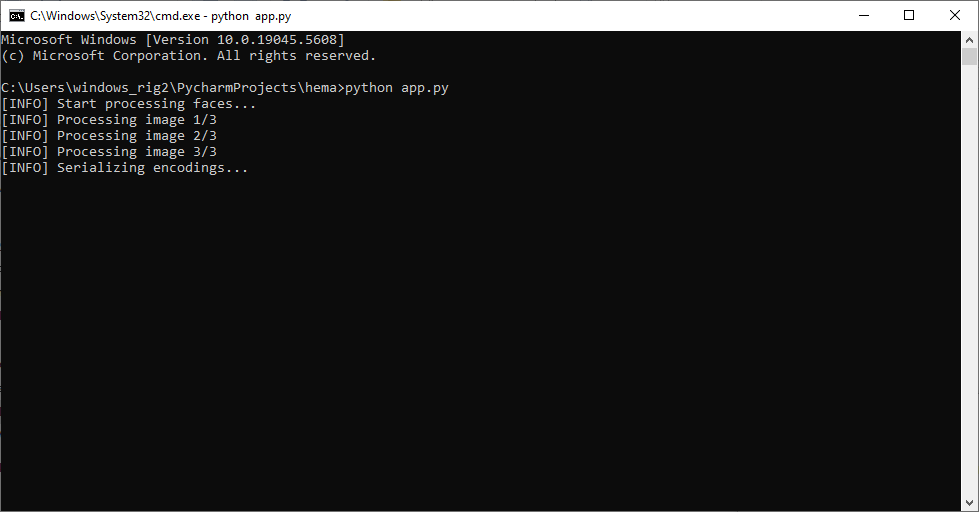
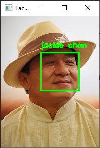

# face recognition - type 1 

ModuleNotFoundError: No module named 'cmake'

      ================================================================================
      ================================================================================
      ================================================================================

                         CMake is not installed on your system!

          Or it is possible some broken copy of cmake is installed on your system.
          It is unfortunately very common for python package managers to include
          broken copies of cmake.  So if the error above this refers to some file
          path to a cmake file inside a python or anaconda or miniconda path then you
          should delete that broken copy of cmake from your computer.

          Instead, please get an official copy of cmake from one of these known good
          sources of an official cmake:
              - cmake.org (this is how windows users should get cmake)
              - apt install cmake (for Ubuntu or Debian based systems)
              - yum install cmake (for Redhat or CenOS based systems)

          On a linux machine you can run `which cmake` to see what cmake you are
          actually using.  If it tells you it's some cmake from any kind of python
          packager delete it and install an official cmake.

          More generally, cmake is not installed if when you open a terminal window
          and type
             cmake --version
          you get an error.  So you can use that as a very basic test to see if you
          have cmake installed.  That is, if cmake --version doesn't run from the
          same terminal window from which you are reading this error message, then
          you have not installed cmake.  Windows users should take note that they
          need to tell the cmake installer to add cmake to their PATH.  Since you
          can't run commands that are not in your PATH.  This is how the PATH works
          on Linux as well, but failing to add cmake to the PATH is a particularly
          common problem on windows and rarely a problem on Linux.

      ================================================================================
      ================================================================================
      ================================================================================

START + R -> Run Window -> cmd

C:\Users\windows_rig2> 

run following commands

```commandline
pip install cmake
```

```commandline
pip install dlib
```

```commandline
pip install face_recognition
```

```commandline
pip install imutils
```






