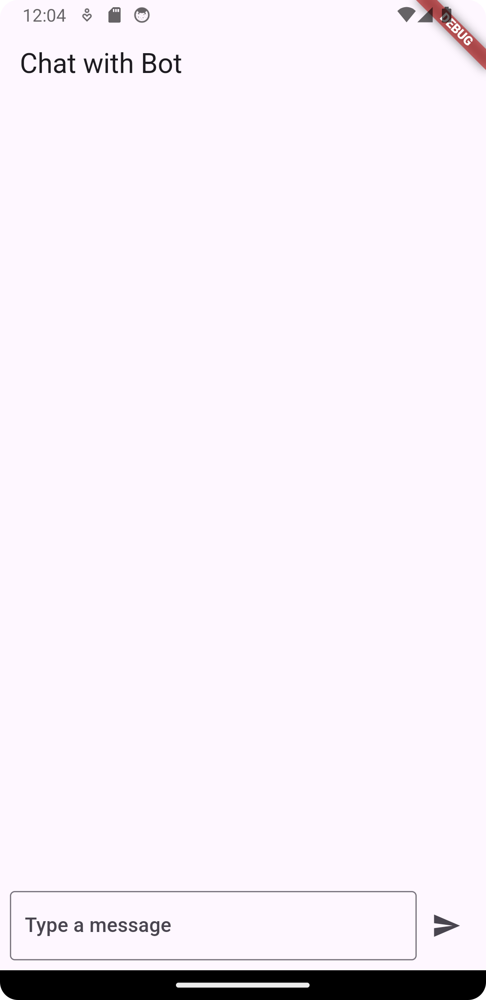
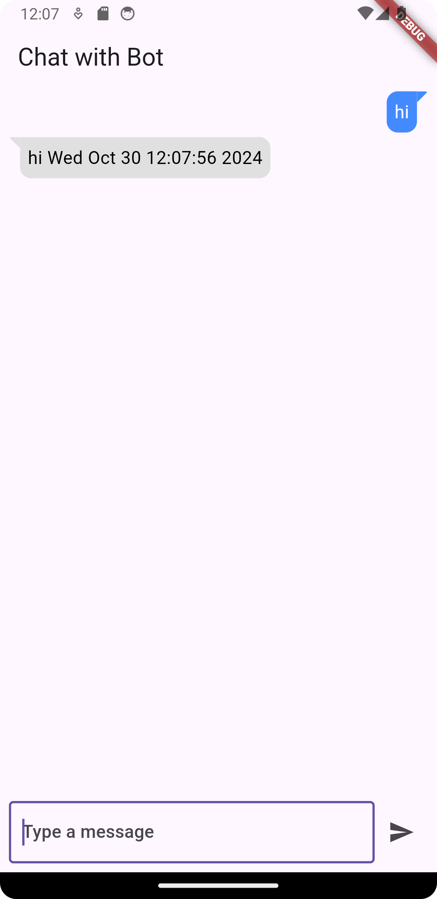
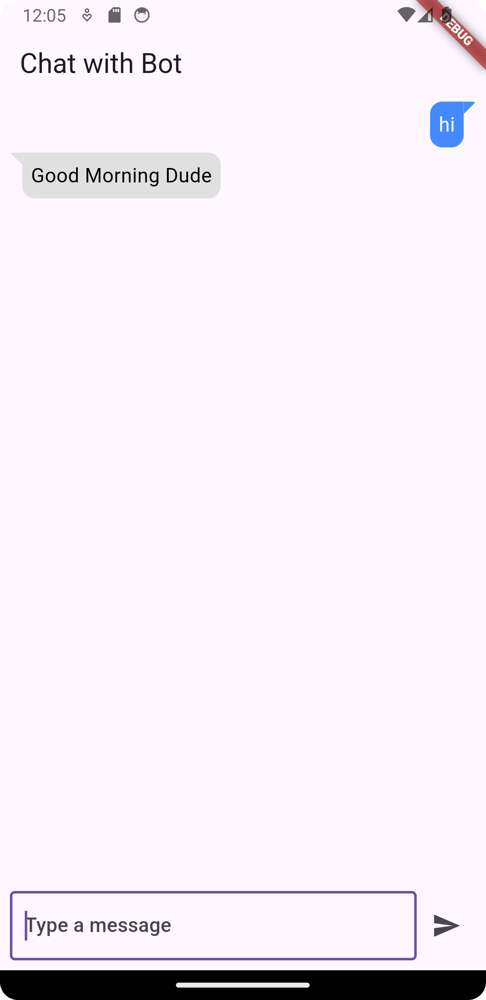
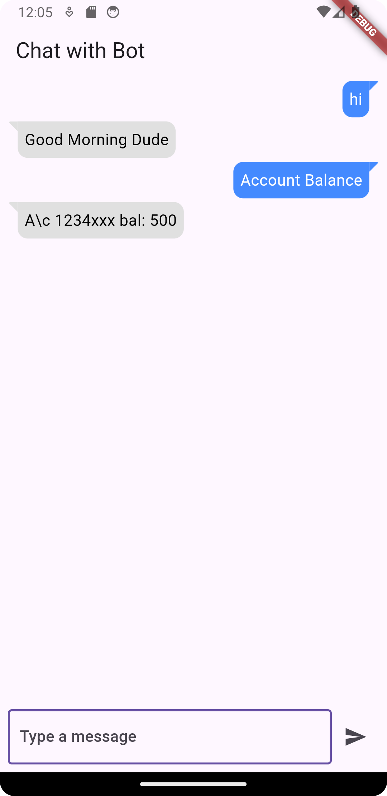

```commandline
pip install flask
```

```commandline
pip install gunicorn
```

Procfile

```commandline
web: gunicorn app:app
```
# Type 1

```python
from flask import Flask, jsonify, request
import time

app = Flask(__name__)

@app.route("/bot", methods=['POST'])
def response():
    query = request.form['query']

    result = query + " " + time.ctime()

    return jsonify({"response": result})

if __name__ == "__main__":
    app.run(host="0.0.0.0")
```

To test the Flask `/bot` endpoint with a POST request in Postman, follow these steps:

1. **Open Postman** and create a new request.
2. Set the request **method** to **POST**.
3. In the **URL** field, enter the endpoint URL, such as:
   ```
   http://127.0.0.1:5000/bot
   ```
   (Replace `127.0.0.1:5000` with your server's IP address and port if they differ.)

4. Go to the **Body** tab, select **form-data**.
5. Add a **key-value pair**:
   - **Key**: `query`
   - **Value**: any sample text you want to send, e.g., `"Hello, bot!"`

6. **Send the request**.

The server should respond with a JSON object that looks something like this:

```json
{
    "response": "Hello, bot! Tue Oct 31 14:23:18 2024"
}
```

This confirms that your endpoint is working as expected.





# Type 2

To send a POST request with a raw JSON payload in Postman, follow these steps:

1. **Open Postman** and create a new request.
2. Set the request **method** to **POST**.
3. In the **URL** field, enter the endpoint URL:
   ```
   http://127.0.0.1:5000/bot
   ```
   (Replace `127.0.0.1:5000` with your server's IP and port if different.)

4. Go to the **Body** tab and select **raw**.
5. From the dropdown next to the raw option, choose **JSON** as the format.
6. In the JSON editor, enter your JSON payload. For example:

   ```json
   {
       "query": "Hello, bot!"
   }
   ```

7. **Send the request**.

For your Flask code to process this JSON data, update it to use `request.json` instead of `request.form`:

```python
from flask import Flask, jsonify, request
import time

app = Flask(__name__)

@app.route("/bot", methods=['POST'])
def response():
    query = request.json.get('query', '')  # Get 'query' from JSON payload
    result = query + " " + time.ctime()
    return jsonify({"response": result})

if __name__ == "__main__":
    app.run(host="0.0.0.0")
```

This version will correctly parse the JSON payload from Postman, and the response will look like:

```json
{
    "response": "Hello, bot! Tue Oct 31 14:23:18 2024"
}
```


# Type 3

```python
from flask import Flask, jsonify, request
import time

app = Flask(__name__)

@app.route("/bot", methods=['POST'])
def response():
    query = request.form['query']
    result = query + " " + time.ctime()

    if query == "hi" or query == "Hi":
        return jsonify({"response": "Good Morning Dude"})
    elif query == "Account Balance" or query == "account balance":
        return jsonify({"response": "A\\c 1234xxx bal: 500"})
    else:
        # If no specific response, return result with timestamp
        return jsonify({"response": result})

if __name__ == "__main__":
    app.run(host="0.0.0.0")
```

To test this endpoint using Postman, follow these steps:

1. **Open Postman** and create a new request.

2. **Set Request Type**:
   - Change the request type to `POST`.

3. **Enter the Request URL**:
   - Use the following URL (adjust the port if needed):
     ```
     http://127.0.0.1:5000/bot
     ```

4. **Set the Request Body**:
   - Go to the **Body** tab in Postman.
   - Select **form-data**.
   - Add a key-value pair:
     - **Key**: `query`
     - **Value**: `hi` (or any other test query, like `Account Balance`)

5. **Send the Request**:
   - Click on **Send** to send the request.

6. **View the Response**:
   - You should see a JSON response, for example:
     ```json
     {
       "response": "Good Morning Dude"
     }
     ```
   - If you send `Account Balance` as the query, you should get:
     ```json
     {
       "response": "A\\c 1234xxx bal: 500"
     }
     ```
   - If you send any other query, it should return the query with a timestamp





# Flutter

To integrate a chat screen in Flutter using the `chat_bubbles` package, we can set up a simple chat UI where a Flutter app can communicate with the Flask bot API. The chat bubbles will display user messages and bot responses.

Here’s how you can create the Flutter chat screen:

### Step 1: Set Up the `chat_bubbles` Package in Your `pubspec.yaml`
Add the `chat_bubbles` dependency to your Flutter project:

```yaml
dependencies:
  flutter:
    sdk: flutter
  chat_bubbles: ^1.3.0  # Check for the latest version on pub.dev
  http: ^0.13.5  # For sending requests to Flask server
```

Run `flutter pub get` to install the package.

### Step 2: Create the Chat Screen

Create a new Dart file, e.g., `ChatScreen.dart`, and implement the chat screen as follows:

```dart
import 'package:flutter/material.dart';
import 'package:chat_bubbles/chat_bubbles.dart';
import 'package:http/http.dart' as http;
import 'dart:convert';

class ChatScreen extends StatefulWidget {
  @override
  _ChatScreenState createState() => _ChatScreenState();
}

class _ChatScreenState extends State<ChatScreen> {
  final TextEditingController _controller = TextEditingController();
  final List<Map<String, String>> _messages = [];

  Future<void> sendMessage(String message) async {
    // Display the user's message
    setState(() {
      _messages.add({"sender": "user", "text": message});
    });

    // Clear the text field
    _controller.clear();

    // Send message to the Flask server
    final response = await http.post(
      Uri.parse("http://<FLASK_SERVER_IP>:5000/bot"),
      body: {"query": message},
    );

    if (response.statusCode == 200) {
      final botResponse = json.decode(response.body)['response'];
      setState(() {
        _messages.add({"sender": "bot", "text": botResponse});
      });
    } else {
      setState(() {
        _messages.add({"sender": "bot", "text": "Error: Unable to connect"});
      });
    }
  }

  @override
  Widget build(BuildContext context) {
    return Scaffold(
      appBar: AppBar(
        title: Text('Chat with Bot'),
      ),
      body: Column(
        children: [
          Expanded(
            child: ListView.builder(
              itemCount: _messages.length,
              itemBuilder: (context, index) {
                final message = _messages[index];
                return message['sender'] == 'user'
                    ? BubbleSpecialOne(
                        text: message['text']!,
                        isSender: true,
                        color: Colors.blueAccent,
                        textStyle: TextStyle(
                          color: Colors.white,
                          fontSize: 16,
                        ),
                      )
                    : BubbleSpecialOne(
                        text: message['text']!,
                        isSender: false,
                        color: Colors.grey.shade300,
                        textStyle: TextStyle(
                          color: Colors.black,
                          fontSize: 16,
                        ),
                      );
              },
            ),
          ),
          Padding(
            padding: const EdgeInsets.all(8.0),
            child: Row(
              children: [
                Expanded(
                  child: TextField(
                    controller: _controller,
                    decoration: InputDecoration(
                      hintText: "Type a message",
                      border: OutlineInputBorder(),
                    ),
                  ),
                ),
                IconButton(
                  icon: Icon(Icons.send),
                  onPressed: () {
                    if (_controller.text.isNotEmpty) {
                      sendMessage(_controller.text);
                    }
                  },
                ),
              ],
            ),
          ),
        ],
      ),
    );
  }
}
```

### Step 3: Launch the Chat Screen

In your main `MaterialApp`, set the `ChatScreen` as the home screen or navigate to it from another screen.

```dart
import 'package:flutter/material.dart';
import 'chat_screen.dart';

void main() {
  runApp(MyApp());
}

class MyApp extends StatelessWidget {
  @override
  Widget build(BuildContext context) {
    return MaterialApp(
      title: 'Flutter Chat with Flask Bot',
      theme: ThemeData(
        primarySwatch: Colors.blue,
      ),
      home: ChatScreen(),
    );
  }
}
```

### Notes
- Replace `<FLASK_SERVER_IP>` with the IP address where your Flask server is running.
- Start the Flask server using `python app.py` to test this setup.
- The `chat_bubbles` package provides easy-to-use and customizable chat bubble widgets for a nice chat experience.