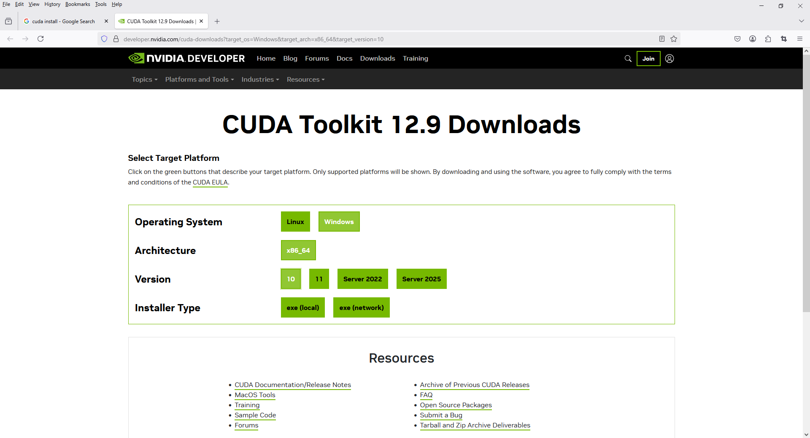
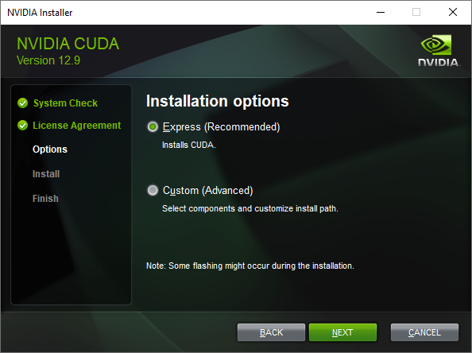
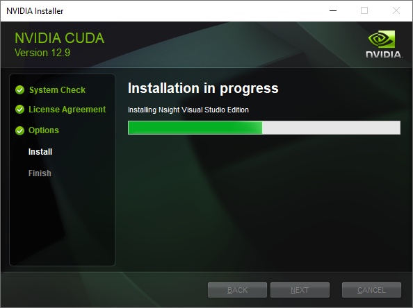

If you're using a GTX 1050 Ti and `torch.cuda.is_available()` returns `False`, it means PyTorch is not detecting your GPU correctly. Here’s a checklist to fix the issue:

---

### ✅ 1. **Verify GPU Support**

GTX 1050 Ti **does support CUDA**. So that’s fine.

---

### ✅ 2. **Check PyTorch Installation**

You may have installed the **CPU-only version** of PyTorch. Reinstall PyTorch with CUDA support:

#### Run this in your terminal/command prompt:

**For CUDA 11.8 (recommended for 1050 Ti):**

```bash
pip uninstall torch
pip install torch torchvision torchaudio --index-url https://download.pytorch.org/whl/cu118
```

Other CUDA versions: [https://pytorch.org/get-started/locally/](https://pytorch.org/get-started/locally/)

---

### ✅ 3. **Check CUDA Toolkit**

Make sure CUDA Toolkit is installed. You can check from the terminal:

```bash
nvcc --version
```

If not installed, download from:
[https://developer.nvidia.com/cuda-downloads](https://developer.nvidia.com/cuda-downloads)

Make sure the CUDA version matches the one PyTorch was built with (e.g., CUDA 11.8 or 12.1).

---

### ✅ 4. **Check NVIDIA Driver**

Ensure your GPU drivers are up to date.

* Open NVIDIA Control Panel → Help → System Information
* Or in terminal:

```bash
nvidia-smi
```

It should list your GPU and driver version.

---

### ✅ 5. **Check PyTorch Detection**

Run this Python script to debug:

```python
import torch
print("CUDA available:", torch.cuda.is_available())
print("CUDA device count:", torch.cuda.device_count())
print("CUDA device name:", torch.cuda.get_device_name(0) if torch.cuda.is_available() else "None")
```

---

### ✅ 6. **Environment Issues**

If you're using **Anaconda**, make sure the environment has the correct CUDA support.

```bash
conda install pytorch torchvision torchaudio pytorch-cuda=11.8 -c pytorch -c nvidia
```

---

Would you like help identifying your installed CUDA and PyTorch versions or help installing the right one?

`app.py`

```python
import torch
print("CUDA available:", torch.cuda.is_available())
print("CUDA device count:", torch.cuda.device_count())
print("CUDA device name:", torch.cuda.get_device_name(0) if torch.cuda.is_available() else "None")
```

```
CUDA available: True
CUDA device count: 1
CUDA device name: NVIDIA GeForce GTX 1050 Ti
```